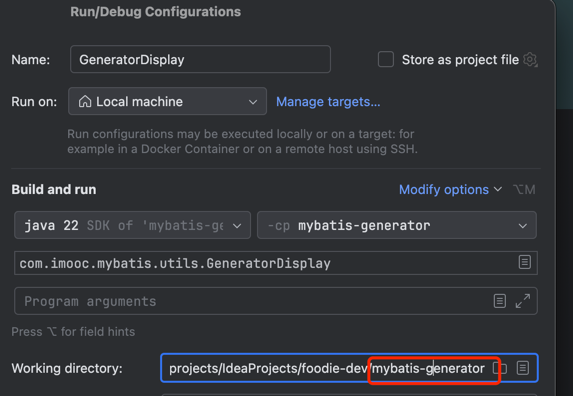

### Spring Boot

#### 引入依赖 parent

```xml

<parent>
    <groupId>org.springframework.boot</groupId>
    <artifactId>spring-boot-starter-parent</artifactId>
    <version>2.7.5</version>
    <relativePath/>
</parent>
```

#### 设置资源属性

```properties
    <properties>
<project.build.sourceEncoding>UTF-8</project.build.sourceEncoding>
<project.reporting.outputEncoding>UTF-8</project.reporting.outputEncoding>
<java.version>17</java.version>
</properties>
```

#### 引入依赖

```xml

<dependencies>
    <dependency>
        <groupId>org.springframework.boot</groupId>
        <artifactId>spring-boot-starter</artifactId>
        <!--            <exclusions>-->
        <!--                <exclusion>-->
        <!--                    <groupId>org.springframework.boot</groupId>-->
        <!--                    <artifactId>spring-boot-starter-logging</artifactId>-->
        <!--                </exclusion>-->
        <!--            </exclusions>-->
    </dependency>
    <dependency>
        <groupId>org.springframework.boot</groupId>
        <artifactId>spring-boot-starter-web</artifactId>
    </dependency>
    <dependency>
        <groupId>org.springframework.boot</groupId>
        <artifactId>spring-boot-configuration-processor</artifactId>
        <optional>true</optional>
    </dependency>
</dependencies>
```

### 整合HikariCP

#### 引入数据源驱动 & MyBatis

```xml

<dependencies>
    <dependency>
        <groupId>mysql</groupId>
        <artifactId>mysql-connector-java</artifactId>
    </dependency>
    <dependency>
        <groupId>org.mybatis.spring.boot</groupId>
        <artifactId>mybatis-spring-boot-starter</artifactId>
        <version>2.2.2</version>
    </dependency>
</dependencies>
```

#### 配置数据源和MyBatis

```yaml
##################################################################
#                    配置数据源
##################################################################
spring:
  datasource:
    type: com.zaxxer.hikari.HikariDataSource
    driver-class-name: com.mysql.cj.jdbc.Driver
    url: jdbc:mysql://192.168.0.195:3306/foodie?characterEncoding=UTF-8&useSSL=false&useUnicode=true&serverTimezone=UTC
    username: root
    password: root
    hikari:
      connection-timeout: 30000         # 等待连接池分配连接的最大时长（毫秒），超过这个时长还没可用的连接则发生SQLException， 默认：30秒
      minimum-idle: 5                   # 最小连接数
      maximum-pool-size: 20             # 最大连接数
      auto-commit: true                 # 自动提交
      idle-timeout: 600000              # 连接超时的最大时长（毫秒），超时则被释放（retired），默认：10分钟
      pool-name: DataSourceHikariCP     # 连接池名字
      max-lifetime: 1800000             # 连接的生命时长（毫秒），超时而且没被使用则被释放 （retired），默认：30分钟 1800000ms
      connection-test-query: SELECT 1

##################################################################
#                    MyBatis 配置
##################################################################
mybatis:
  type-aliases-package: com.imooc.pojo      # 所有POJO 类所在包路径
  mapper-locations: classpath:mapper/*.xml  # mapper 映射文件
```

#### 配置 Tomcat

```yaml
##################################################################
#                    Tomcat 配置
##################################################################
server:
  port: 8088
  tomcat:
    uri-encoding: UTF-8
  max-http-header-size: 80KB
```

### MyBatis 逆向工程

当将逆向工程在聚合工程下，可能存在如下问题：

```
The specified target project directory src\main\resources does not exist
```

#### 解决方案1

```xml

<generatorConfiguration>
    <!-- 对应生成的pojo所在包 -->
    <javaModelGenerator targetPackage="com.imooc.pojo" targetProject="src/main/java"/>
    <!-- 通过指向具体工程名前缀 -->
    <javaModelGenerator targetPackage="com.imooc.pojo" targetProject="mybatis-generator/src/main/java"/>
</generatorConfiguration>
```

#### 解决方案2
修改运行时工作目录，默认是聚合工程，修改为当前工程，即逆向工程 mybatis-generator.


#### 复制生成物料到应对工程并做配置
```xml
<!--mapper-->
<dependency>
    <groupId>tk.mybatis</groupId>
    <artifactId>mapper-spring-boot-starter</artifactId>
    <version>1.2.4</version>
</dependency>
```


