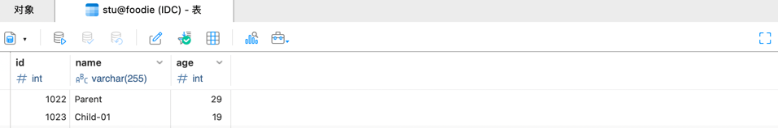

### Spring Boot

#### 引入依赖 parent

```xml

<parent>
    <groupId>org.springframework.boot</groupId>
    <artifactId>spring-boot-starter-parent</artifactId>
    <version>2.7.5</version>
    <relativePath/>
</parent>
```

#### 设置资源属性

```properties
    <properties>
<project.build.sourceEncoding>UTF-8</project.build.sourceEncoding>
<project.reporting.outputEncoding>UTF-8</project.reporting.outputEncoding>
<java.version>17</java.version>
</properties>
```

#### 引入依赖

```xml

<dependencies>
    <dependency>
        <groupId>org.springframework.boot</groupId>
        <artifactId>spring-boot-starter</artifactId>
        <!--            <exclusions>-->
        <!--                <exclusion>-->
        <!--                    <groupId>org.springframework.boot</groupId>-->
        <!--                    <artifactId>spring-boot-starter-logging</artifactId>-->
        <!--                </exclusion>-->
        <!--            </exclusions>-->
    </dependency>
    <dependency>
        <groupId>org.springframework.boot</groupId>
        <artifactId>spring-boot-starter-web</artifactId>
    </dependency>
    <dependency>
        <groupId>org.springframework.boot</groupId>
        <artifactId>spring-boot-configuration-processor</artifactId>
        <optional>true</optional>
    </dependency>
</dependencies>
```

### 整合HikariCP

#### 引入数据源驱动 & MyBatis

```xml

<dependencies>
    <dependency>
        <groupId>mysql</groupId>
        <artifactId>mysql-connector-java</artifactId>
    </dependency>
    <dependency>
        <groupId>org.mybatis.spring.boot</groupId>
        <artifactId>mybatis-spring-boot-starter</artifactId>
        <version>2.2.2</version>
    </dependency>
</dependencies>
```

#### 配置数据源和MyBatis

```yaml
##################################################################
#                    配置数据源
##################################################################
spring:
  datasource:
    type: com.zaxxer.hikari.HikariDataSource
    driver-class-name: com.mysql.cj.jdbc.Driver
    url: jdbc:mysql://192.168.0.195:3306/foodie?characterEncoding=UTF-8&useSSL=false&useUnicode=true&serverTimezone=UTC
    username: root
    password: root
    hikari:
      connection-timeout: 30000         # 等待连接池分配连接的最大时长（毫秒），超过这个时长还没可用的连接则发生SQLException， 默认：30秒
      minimum-idle: 5                   # 最小连接数
      maximum-pool-size: 20             # 最大连接数
      auto-commit: true                 # 自动提交
      idle-timeout: 600000              # 连接超时的最大时长（毫秒），超时则被释放（retired），默认：10分钟
      pool-name: DataSourceHikariCP     # 连接池名字
      max-lifetime: 1800000             # 连接的生命时长（毫秒），超时而且没被使用则被释放 （retired），默认：30分钟 1800000ms
      connection-test-query: SELECT 1

##################################################################
#                    MyBatis 配置
##################################################################
mybatis:
  type-aliases-package: com.imooc.pojo      # 所有POJO 类所在包路径
  mapper-locations: classpath:mapper/*.xml  # mapper 映射文件
```

#### 配置 Tomcat

```yaml
##################################################################
#                    Tomcat 配置
##################################################################
server:
  port: 8088
  tomcat:
    uri-encoding: UTF-8
  max-http-header-size: 80KB
```

### MyBatis 逆向工程

当将逆向工程在聚合工程下，可能存在如下问题：

```
The specified target project directory src\main\resources does not exist
```

#### 解决方案1

```xml

<generatorConfiguration>
    <!-- 对应生成的pojo所在包 -->
    <javaModelGenerator targetPackage="com.imooc.pojo" targetProject="src/main/java"/>
    <!-- 通过指向具体工程名前缀 -->
    <javaModelGenerator targetPackage="com.imooc.pojo" targetProject="mybatis-generator/src/main/java"/>
</generatorConfiguration>
```

#### 解决方案2

修改运行时工作目录，默认是聚合工程，修改为当前工程，即逆向工程 mybatis-generator.


#### 复制生成物料到应对工程并做配置

```xml
<!--mapper-->
<dependency>
    <groupId>tk.mybatis</groupId>
    <artifactId>mapper-spring-boot-starter</artifactId>
    <version>1.2.4</version>
</dependency>
```

### 事务的传播特性

#### 无事务

```java

@Override
public void testPropagation() {
    stuService.saveParent();
    stuService.saveChildren();
}
```

```java

@Override
public void saveParent() {
    stuMapper.insert(Stu.builder().name("Parent").age(29).build());
}

@Transactional(propagation = Propagation.SUPPORTS)
@Override
public void saveChildren() {
    saveChild1();
    int exp = 1 / 0;
    saveChild2();
}

private void saveChild1() {
    stuMapper.insert(Stu.builder().name("Child-01").age(19).build());
}

private void saveChild2() {
    stuMapper.insert(Stu.builder().name("Child-02").age(18).build());
}

```

> REQUIRED
> 1. 使用当前事务, 如果当前没有事务，就新建一个事务;
> 2. 子方法必须运行在同一个事务中；
> 3. 如何方法存在事务，就加入这个事务。

```text
java.lang.ArithmeticException: / by zero
```



结论： Parent 和 Child-01 都插入成功，但是 Child-02 没有插入。

#### 父方法设置 REQUIRED

```java

@Transactional(propagation = Propagation.REQUIRED)
@Override
public void testPropagation() {
    stuService.saveParent();
    stuService.saveChildren();
}
```

```java

@Override
public void saveParent() {
    stuMapper.insert(Stu.builder().name("Parent").age(29).build());
}

@Override
public void saveChildren() {
    saveChild1();
    int exp = 1 / 0;
    saveChild2();
}

private void saveChild1() {
    stuMapper.insert(Stu.builder().name("Child-01").age(19).build());
}

private void saveChild2() {
    stuMapper.insert(Stu.builder().name("Child-02").age(18).build());
}
```


1. 事务的传播，父方法 testPropagation 会把事务传递给子方法 saveParent 和 saveChildren;
2. 当其中一个发生异常，都会回滚。所以 Parent 和 Child-01、Child-02
   都没有插入。

#### 子方法设置 REQUIRED

```java

@Override
public void testPropagation() {
    stuService.saveParent();
    stuService.saveChildren();
}
```

```java

@Transactional(propagation = Propagation.REQUIRED)
@Override
public void saveChildren() {
    saveChild1();
    int exp = 1 / 0;
    saveChild2();
}

private void saveChild1() {
    stuMapper.insert(Stu.builder().name("Child-01").age(19).build());
}

private void saveChild2() {
    stuMapper.insert(Stu.builder().name("Child-02").age(18).build());
}
```


1. 父方法 testPropagation 没有设置事务。插入值 Parent。
2. 子方法 saveChildren 设置了事务，发生异常会回滚。没能插入值 Child-01 和 Child-02。

#### 父、子方法都设置 REQUIRED

```java

@Transactional(propagation = Propagation.REQUIRED)
@Override
public void testPropagation() {
    stuService.saveParent();
    stuService.saveChildren();
}
```

```java

@Transactional(propagation = Propagation.REQUIRED)
@Override
public void saveChildren() {
    saveChild1();
    int exp = 1 / 0;
    saveChild2();
}

private void saveChild1() {
    stuMapper.insert(Stu.builder().name("Child-01").age(19).build());
}

private void saveChild2() {
    stuMapper.insert(Stu.builder().name("Child-02").age(18).build());
}
```

#### SUPPORTS

> SUPPORTS
> 1. 如果当前有事务，则使用当前事务;
> 2. 如果当前没有事务，就以非事务方式执行;

#### 父方法无事务，子方法 SUPPORTS

```java

@Override
public void testPropagation() {
    stuService.saveParent();
    stuService.saveChildren();
}
```

```java

@Transactional(propagation = Propagation.SUPPORTS)
@Override
public void saveChildren() {
    saveChild1();
    int exp = 1 / 0;
    saveChild2();
}

private void saveChild1() {
    stuMapper.insert(Stu.builder().name("Child-01").age(19).build());
}

private void saveChild2() {
    stuMapper.insert(Stu.builder().name("Child-02").age(18).build());
}
```


1. SUPPORTS 是随着父方法 testPropagation 的事务
2. 父方法没有事务，所以子方法也就没有事务

#### 父方法 REQUIRED，子方法 SUPPORTS

```java

@Transactional(propagation = Propagation.REQUIRED)
@Override
public void testPropagation() {
    stuService.saveParent();
    stuService.saveChildren();
}
```

```java

@Transactional(propagation = Propagation.SUPPORTS)
@Override
public void saveChildren() {
    saveChild1();
    int exp = 1 / 0;
    saveChild2();
}

private void saveChild1() {
    stuMapper.insert(Stu.builder().name("Child-01").age(19).build());
}

private void saveChild2() {
    stuMapper.insert(Stu.builder().name("Child-02").age(18).build());
}
```

1. 父方法 REQUIRED
2. 子方法 SUPPORTS ，事务随着父方法
3. 最终，发生异常，全部回滚

> ![note]
> REQUIRED 和 SUPPORTS 是最常用的事务传播特性。

#### MANDATORY

> MANDATORY
> 1. 如果当前有事务，则使用当前事务;
> 2. 如果当前没有事务，就抛出异常;

#### 父方法无事务，子方法 MANDATORY

```java

@Override
public void testPropagation() {
    stuService.saveParent();
    stuService.saveChildren();
}
```

```java

@Transactional(propagation = Propagation.MANDATORY)
@Override
public void saveChildren() {
    saveChild1();
    int exp = 1 / 0;
    saveChild2();
}

private void saveChild1() {
    stuMapper.insert(Stu.builder().name("Child-01").age(19).build());
}

private void saveChild2() {
    stuMapper.insert(Stu.builder().name("Child-02").age(18).build());
}
```

```text
org.springframework.transaction.IllegalTransactionStateException: No existing transaction found for transaction marked with propagation 'mandatory'
```


1. 父方法没有事务，插入值 Parent
2. 父方法没有事务，子方法 MANDATORY，抛出异常，Child-01 和 Child-02 都没有插入。

#### 父方法 REQUIRED，子方法 MANDATORY

```java

@Transactional(propagation = Propagation.REQUIRED)
@Override
public void testPropagation() {
    stuService.saveParent();
    stuService.saveChildren();
}
```

```java

@Transactional(propagation = Propagation.MANDATORY)
@Override
public void saveChildren() {
    saveChild1();
    int exp = 1 / 0;
    saveChild2();
}

private void saveChild1() {
    stuMapper.insert(Stu.builder().name("Child-01").age(19).build());
}

private void saveChild2() {
    stuMapper.insert(Stu.builder().name("Child-02").age(18).build());
}
```


1. 父方法 REQUIRED
2. 子方法 MANDATORY ，事务随着父方法，使用父方法事务
3. 发生异常，全部回滚

#### REQUIRES_NEW

> REQUIRES_NEW
> 1. 总是开启一个新的事务;
> 2. 如果当前存在事务，则把当前事务挂起;
> 3. 如果当前没有事务，则相当于 REQUIRED;

#### 父方法无事务 ，子方法 REQUIRES_NEW

```java

@Override
public void testPropagation() {
    stuService.saveParent();
    stuService.saveChildren();
}
```

```java

@Transactional(propagation = Propagation.REQUIRES_NEW)
@Override
public void saveChildren() {
    saveChild1();
    int exp = 1 / 0;
    saveChild2();
}

private void saveChild1() {
    stuMapper.insert(Stu.builder().name("Child-01").age(19).build());
}

private void saveChild2() {
    stuMapper.insert(Stu.builder().name("Child-02").age(18).build());
}
```


1. 父方法没有事务，插入值 Parent
2. 子方法 REQUIRES_NEW ，开启一个新的事务
3. 发生异常，子方法 REQUIRES_NEW 的事务回滚，子方法没有插入值 Child-01 和 Child-02

#### 父方法 REQUIRED，子方法 REQUIRES_NEW

```java

@Transactional(propagation = Propagation.REQUIRED)
@Override
public void testPropagation() {
    stuService.saveParent();
    stuService.saveChildren();
}
```

```java

@Transactional(propagation = Propagation.REQUIRES_NEW)
@Override
public void saveChildren() {
    saveChild1();
    int exp = 1 / 0;
    saveChild2();
}

private void saveChild1() {
    stuMapper.insert(Stu.builder().name("Child-01").age(19).build());
}

private void saveChild2() {
    stuMapper.insert(Stu.builder().name("Child-02").age(18).build());
}
```


1. 父方法 REQUIRED
2. 子方法 REQUIRES_NEW ，开启一个新的事务
3. 子方法发生异常后回滚，子方法没有插入值 Child-01 和 Child-02
4. 子方法发生异常后，会影响父方法，父方法也回滚，Parent 也没有插入值

#### 父方法 REQUIRED，子方法 REQUIRES_NEW

> 子方法正常调用完成后（无异常），父方法异常情况
> 把异常放到父方法，异常点在子方法执行完成后

```java

@Transactional(propagation = Propagation.REQUIRED)
@Override
public void testPropagation() {
    stuService.saveParent();
    stuService.saveChildren();
    // 异常点 
    int exp = 1 / 0;
}
```

```java

@Transactional(propagation = Propagation.REQUIRES_NEW)
@Override
public void saveChildren() {
    saveChild1();
    saveChild2();
}

private void saveChild1() {
    stuMapper.insert(Stu.builder().name("Child-01").age(19).build());
}

private void saveChild2() {
    stuMapper.insert(Stu.builder().name("Child-02").age(18).build());
}
```


1. 父方法 REQUIRED，持有一个事务
2. 子方法 REQUIRES_NEW ，开启一个新的事务
3. 当前有分别有两个事务
4. 父方法执行插入操作，未提交事务（挂起），调用子方法
5. 子方法执行插入操作，插入值 Child-01 和 Child-02，并提交事务，子方法返回
6. 父方法发生异常，回滚之前的插入操作

#### NOT_SUPPORTED & NEVER

> NOT_SUPPORTED
> 1. 非事务执行;
> 2. 如果当前存在事务，则把当前事务挂起;
>
> NEVER
> 1. 非事务执行;
> 2. 如果当前存在事务，则抛出异常;

#### 父方法无事务，子方法 NOT_SUPPORTED

```java

@Override
public void testPropagation() {
    stuService.saveParent();
    stuService.saveChildren();
    // 异常点 
    int exp = 1 / 0;
}
```

```java

@Transactional(propagation = Propagation.NOT_SUPPORTED)
@Override
public void saveChildren() {
    saveChild1();
    saveChild2();
}

private void saveChild1() {
    stuMapper.insert(Stu.builder().name("Child-01").age(19).build());
}

private void saveChild2() {
    stuMapper.insert(Stu.builder().name("Child-02").age(18).build());
}
```


1. 父方法无事务，插入值 Parent
2. 子方法 NOT_SUPPORTED ，非事务执行，插入值 Child-01
3. 发生异常，Child-02 没有插入
4. 等于整个方法都在非事务中执行

#### 父方法 REQUIRED，子方法 NOT_SUPPORTED

```java

@Transactional(propagation = Propagation.REQUIRED)
@Override
public void testPropagation() {
    stuService.saveParent();
    stuService.saveChildren();
    // 异常点 
    int exp = 1 / 0;
}
```

```java

@Transactional(propagation = Propagation.NOT_SUPPORTED)
@Override
public void saveChildren() {
    saveChild1();
    saveChild2();
}

private void saveChild1() {
    stuMapper.insert(Stu.builder().name("Child-01").age(19).build());
}

private void saveChild2() {
    stuMapper.insert(Stu.builder().name("Child-02").age(18).build());
}
```


1. 父方法 REQUIRED，持有一个事务
2. 子方法 NOT_SUPPORTED ，非事务执行，插入值 Child-01
3. 发生异常，子方法没有插入值 Child-02
4. 异常传递给父方法，父方法回滚，Parent 值没能插入

#### 父方法 REQUIRED，子方法 NEVER

```java

@Transactional(propagation = Propagation.REQUIRED)
@Override
public void testPropagation() {
    stuService.saveParent();
    stuService.saveChildren();
    // 异常点 
    int exp = 1 / 0;
}
```

```java

@Transactional(propagation = Propagation.NEVER)
@Override
public void saveChildren() {
    saveChild1();
    saveChild2();
}

private void saveChild1() {
    stuMapper.insert(Stu.builder().name("Child-01").age(19).build());
}

private void saveChild2() {
    stuMapper.insert(Stu.builder().name("Child-02").age(18).build());
}
```


```text
org.springframework.transaction.IllegalTransactionStateException: Existing transaction found for transaction marked with propagation 'never'
```

#### NESTED

> NESTED
> 1. 如果当前存在事务，则开启子事务（嵌套事务），子事务独立提交、回滚;
> 2. 如果当前不存在事务，则开启事务，相当于 REQUIRED;
> 3. 主事务提交、回滚，会携带子事务一起提交、回滚
> 4. 如果子事务发生异常，主事务可以选择是否回滚（参考保存点，下面有具体案例 ）。
>
> NESTED VS REQUIRED_NEW
> 1. REQUIRED_NEW 是两个独立事务，各自独立提交
> 2. NESTED 是一个父子事务，它们是同时提交，

#### 父方法 REQUIRED，子方法 NESTED

> 将异常点放在父方法，在子方法执行完成后，父方法异常

```java

@Transactional(propagation = Propagation.REQUIRED)
@Override
public void testPropagation() {
    stuService.saveParent();
    stuService.saveChildren();
    // 异常点 
    int exp = 1 / 0;
}
```

```java

@Transactional(propagation = Propagation.NESTED)
@Override
public void saveChildren() {
    saveChild1();
    saveChild2();
}

private void saveChild1() {
    stuMapper.insert(Stu.builder().name("Child-01").age(19).build());
}

private void saveChild2() {
    stuMapper.insert(Stu.builder().name("Child-02").age(18).build());
}
```


1. 父方法 REQUIRED，持有一个事务
2. 子方法 NESTED ，开启一个嵌套事务
3. 任何一个方法异常，都会回滚
4. 主事务提交会携带子事务一起提交

#### 父方法 REQUIRED，子方法 NESTED

> 在主方法里捕获子方法的异常，子方法异常不会影响主方法的事务

```java

@Transactional(propagation = Propagation.REQUIRED)
@Override
public void testPropagation() {
    stuService.saveParent();
    // 拦截子方法异常，增加一个保存点 Save Point，子方法的异常不影响主方法的事务 
    try {
        stuService.saveChildren();
    } catch (Exception e) {
        throw new RuntimeException(e);
    }
}
```

```java

@Transactional(propagation = Propagation.NESTED)
@Override
public void saveChildren() {
    saveChild1();
    saveChild2();
}

private void saveChild1() {
    stuMapper.insert(Stu.builder().name("Child-01").age(19).build());
}

private void saveChild2() {
    stuMapper.insert(Stu.builder().name("Child-02").age(18).build());
}
```


1. 主方法持有一个事务
2. 子方法开启一个嵌套事务
3. 子方法发生异常，子事务回滚
4. 主方法选择不回滚主事务：拦截子方法异常，增加一个保存点 Save Point，子方法的异常不影响主方法的事务

### JSON

```java
//@Data
public class JSONResult implements Serializable {

    /**
     * 定义jackson对象
     */
    private static final ObjectMapper MAPPER = new ObjectMapper();

    /**
     * 响应业务状态
     */
    private Integer status;

    /**
     * 响应消息
     */
    private String msg;

    /**
     * 响应中的数据
     */
    private Object data;

    // ...
}
```

```text
2024-08-15 14:26:56.455  WARN 3814 --- [nio-8088-exec-1] .w.s.m.s.DefaultHandlerExceptionResolver : Resolved [org.springframework.web.HttpMediaTypeNotAcceptableException: Could not find acceptable representation]
```

JSONResult 是一个自定义的返回结果类，用于封装响应数据。它包含三个属性：status（响应状态），msg（响应消息），data（响应数据）。
上面的 406 异常是JSONResult 没有设置Getter/Setter。

HTTP 消息转换器 (HttpMessageConverter) 需要访问属性:

- Spring 使用 HttpMessageConverter 如 MappingJackson2HttpMessageConverter 或 FastJsonHttpMessageConverter 来将 Java
  对象序列化为 JSON 格式。
- 这些转换器通常通过反射调用 getter 和 setter 方法来获取或设置对象的属性。
- 如果 JSONResult 类中缺少相应的 getter 或 setter 方法，转换器可能无法正确地读取或写入对象的属性，从而引发异常。

### 用户注册

#### 注册方式

1. 手机号注册
2. 邮箱注册
3. 用户名密码注册

### Swagger2

Swagger2 是一个 RESTful API 文档和 UI 测试工具。它使用 OpenAPI 规范（Swagger 2.0）来描述 RESTful API，并生成文档和客户端代码。

#### 引入依赖

```xml

<dependencys>
    <!-- swagger 2 -->
    <dependency>
        <groupId>io.springfox</groupId>
        <artifactId>springfox-swagger2</artifactId>
        <version>2.4.0</version>
    </dependency>
    <dependency>
        <groupId>io.springfox</groupId>
        <artifactId>springfox-swagger-ui</artifactId>
        <version>2.4.0</version>
    </dependency>
    <!-- 第三方依赖：给 Swagger2 换一个风格 -->
    <dependency>
        <groupId>com.github.xiaoymin</groupId>
        <artifactId>swagger-bootstrap-ui</artifactId>
        <version>1.6</version>
    </dependency>
</dependencys>
```

#### 配置

```java

@Configuration
@EnableSwagger2
public class Swagger2Config {

    /**
     * 配置 Swagger2 核心配置
     * <br>
     * <a href="http://localhost:8088/swagger-ui.html">官方风格</a>
     * <br>
     * <a href="http://localhost:8088/doc.html">三方风格</a>
     *
     * @return
     */
    @Bean
    public Docket createRestApi() {
        return new Docket(DocumentationType.SWAGGER_2)  // 指定 API 类型为 Swagger2
                .apiInfo(apiInfo())                     // 指定 API 文档汇总信息
                .select()
                .apis(RequestHandlerSelectors.basePackage("com.imooc.controller")) // 指定 Controller 扫描包
                .paths(PathSelectors.any())             // 扫描所有
                .build();
    }

    private ApiInfo apiInfo() {
        ApiInfoBuilder builder = new ApiInfoBuilder();
        builder.title("Foodie-API")
                .description("Foodie-API 接口文档")
                .termsOfServiceUrl("https://www.imooc.com")
                .contact(new Contact("David", "https://www.imooc.com", "test@163.com"))
                .version("1.0");
        return builder.build();

    }
}
```


### Swagger2 优化

1. 忽略接口

```java

@ApiIgnore // 忽略该类在 Swagger 中显示
@RestController
public class HelloController {

    @GetMapping("/hello")
    public String hello() {
        return "Hello world!";
    }
}
```

2. 接口说明

```java

@Api(value = "用户注册登录", tags = "注册登录相关接口")
@RestController
@RequestMapping("/passport")
public class PassportController {

    @Resource
    private IUserService userService;

    @ApiOperation(value = "用户名是否存在", notes = "判断传入的用户名在数据库中是否存在", httpMethod = "GET")
    @GetMapping(value = "/usernameIsExists")
    public JSONResult usernameIsExists(@RequestParam("username") String username) {
        if (StringUtils.isBlank(username)) {
            return JSONResult.errorMsg("用户名不能为空");
        }

        boolean isExists = userService.queryUserNameIsExists(username);
        if (isExists) {
            return JSONResult.errorMsg("用户名已存在");
        }

        return JSONResult.ok();
    }
    // ...
}
```

3. 实体说明

```java

@Data
@AllArgsConstructor
@NoArgsConstructor(access = AccessLevel.PRIVATE)
@ToString
@ApiModel(value = "用户 BO", description = "客户端传入的用户数据封闭在这个实体中")
public class UsersBO {
    @ApiModelProperty(value = "用户名", name = "username", example = "GodIsMe", required = true)
    private String username;
    @ApiModelProperty(value = "密码", name = "password", example = "123456", required = true)
    private String password;
    @ApiModelProperty(value = "确认密码", name = "confirmPassword", example = "123456", required = true)
    private String confirmPassword;
}
```


### Cookie

1. 只能保存4KB 数据
2. 保存 SESSIONID

#### 域名分级规则

- **顶级域名（TLD）**：如 `.com`、`.org`、`.net` 等。
- **二级域名（SLD）**：如 `example.com` 中的 `example`。
- **三级域名**：如 `www.example.com` 中的 `www`。

#### Cookie的域属性（Domain）

- **设置域属性**：通过 `cookie.setDomain()` 方法设置。
- **默认行为**：如果不设置域属性，Cookie默认只对设置它的域名有效。
- **包含子域**：如果设置了域属性，并且以`.`开头，例如 `.example.com`，则Cookie对该域名及其所有子域有效。

#### 域名分级与Cookie设置

- **同一级域名**：如果Cookie设置在 `www.example.com`，则默认情况下，该Cookie只对 `www.example.com` 有效。
- **跨子域**：如果想要设置一个对 `example.com` 及其所有子域都有效的Cookie，可以设置域属性为 `.example.com`。

**设置针对所有子域的Cookie**：

```java
Cookie cookie = new Cookie("name", "value");
cookie.setDomain(".example.com");    // 注意前面的点
cookie.setPath("/");                // 可选，设置路径
response.addCookie(cookie);
```

上述设置使得Cookie对 `www.example.com`、`api.example.com`、`blog.example.com` 等所有 `example.com` 的子域有效。

**设置仅对特定子域的Cookie**：

```java
Cookie cookie = new Cookie("name", "value");
cookie.setDomain("www.example.com"); // 没有点，只对www子域有效
cookie.setPath("/");                 // 可选，设置路径
response.addCookie(cookie);
```

上述设置使得 Cookie 只对 `www.example.com` 有效。

#### 当前服务设置

1. 前端服务在 192.168.0.195
2. 后端服务在 192.168.0.193

设置 Cookie ，需要指定 Domain（不能是具体的 IP 地址），所以在两台机器上 Host 处理：

```host
192.168.0.195 server.foodie.com
192.168.0.193 local.foodie.com
```

可以在设置 Cookie 时使用 `.foodie.com` ，这样 server.foodie.com、local.foodie.com 都有效。


### 用户退出 

1. 删除 Cookie
2. 清除会话
3. 清除用户数据

### 日志

```xml
<!-- log4j  -->
<dependency>
    <groupId>org.slf4j</groupId>
    <artifactId>slf4j-api</artifactId>
    <version>1.7.30</version>
</dependency>
<dependency>
    <groupId>org.slf4j</groupId>
    <artifactId>slf4j-log4j12</artifactId>
    <version>1.7.30</version>
</dependency>
```

```properties
# log4j.properties
log4j.rootLogger=DEBUG,stdout,file
log4j.additivity.org.apache=true
#####################################################
# ConsoleAppender
#####################################################
log4j.appender.stdout=org.apache.log4j.ConsoleAppender
log4j.appender.stdout.threshold=INFO
log4j.appender.stdout.layout=org.apache.log4j.PatternLayout
log4j.appender.stdout.layout.ConversionPattern=%-5p %c{1}:%L - %m%n
#####################################################
# DailyRollingFileAppender
#####################################################
log4j.appender.file=org.apache.log4j.DailyRollingFileAppender
log4j.appender.file.layout=org.apache.log4j.PatternLayout
log4j.appender.file.DatePattern='.'yyyy-MM-dd-HH-mm
log4j.appender.file.layout.ConversionPattern=%d{yyyy-MM-dd HH:mm:ss} %-5p %c{1}:%L - %m%n
log4j.appender.file.Threshold=INFO
log4j.appender.file.append=true
log4j.appender.file.File=/Users/david/projects/logs/foodie-api/imooc.log
```

1. DEBUG ：日志级别
2. stdout,file：输出位置
3. log4j.additivity.org.apache=true：这个配置指定了 `org.apache` 包下的日志是否具有可添加性（additivity）。如果设置为 `true`，那么这些日志将同时输出到根日志记录器和指定的 Appender。如果设置为 `false`，则日志只输出到指定的 Appender。
4. log4j.appender.stdout.threshold=INFO：这个配置指定了 `stdout` Appender 的阈值级别。只有大于或等于此级别的日志才会被输出到控制台。
5. log4j.appender.stdout.layout.ConversionPattern=%-5p %c{1}:%L - %m%n
   - `%-5p`：日志级别，占位符 `%` 用于格式化，`-5` 表示级别长度为5个字符，如果级别名称长度小于5，则左对齐。
   - `%c{1}`：Logger 名称，括号内的数字表示格式化后的字符串长度。
   - `%L`：线号，表示日志输出的行号。
   - `- %m%n`：日志消息，占位符 `%` 用于格式化，`-` 表示左对齐，`%m` 表示日志消息，`%n` 表示换行符。
6. log4j.appender.file=org.apache.log4j.DailyRollingFileAppender：这是控制日志输出到文件的 Appender 的配置。`DailyRollingFileAppender` 是一个能够根据日期自动创建新日志文件的 Appender。
7. log4j.appender.file.append=true：这个配置指定了是否追加到现有文件。如果设置为 `true`，则新日志将被追加到现有文件末尾；如果设置为 `false`，则新日志将覆盖现有文件。

### MyBatis 日志

```yaml
mybatis:
  configuration:
    log-impl: org.apache.ibatis.logging.stdout.StdOutImpl
```

```text
INFO  ServiceLogAspect:36 - >>开始执行 com.imooc.service.impl.UserServiceImpl.queryUserForLogin
Creating a new SqlSession
SqlSession [org.apache.ibatis.session.defaults.DefaultSqlSession@3c6c51e6] was not registered for synchronization because synchronization is not active
JDBC Connection [HikariProxyConnection@1210209237 wrapping com.mysql.cj.jdbc.ConnectionImpl@770c3829] will not be managed by Spring
==>  Preparing: SELECT id,username,password,nickname,realname,face,mobile,email,sex,birthday,created_time,updated_time FROM users WHERE ( username = ? and password = ? )
==> Parameters: David(String), lueSGJZetyySpUndWjMBEg==(String)
<==    Columns: id, username, password, nickname, realname, face, mobile, email, sex, birthday, created_time, updated_time
<==        Row: 240815GDAWW86ZXP, David, lueSGJZetyySpUndWjMBEg==, David, null, https://img.alicdn.com/imgextra/i2/O1CN01tTGNxM25zwAC9ZSAA_!!6000000007598-2-tps-400-400.png, null, null, null, 1989-12-31, 2024-08-15 13:41:15, 2024-08-15 13:41:15
<==      Total: 1
Closing non transactional SqlSession [org.apache.ibatis.session.defaults.DefaultSqlSession@3c6c51e6]
INFO  ServiceLogAspect:48 - >>执行结束 com.imooc.service.impl.UserServiceImpl.queryUserForLogin，耗时：269ms
```

